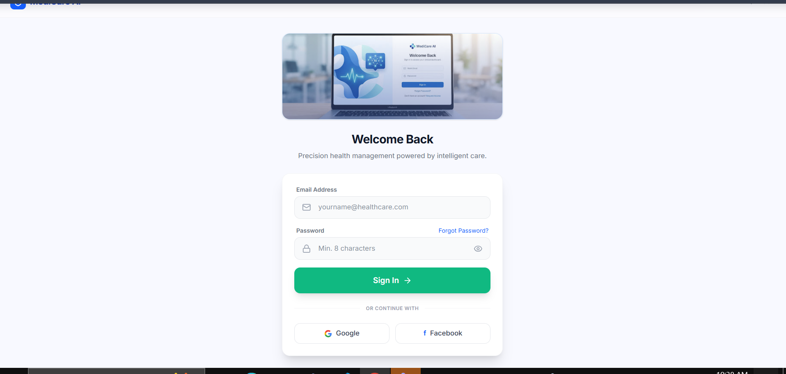
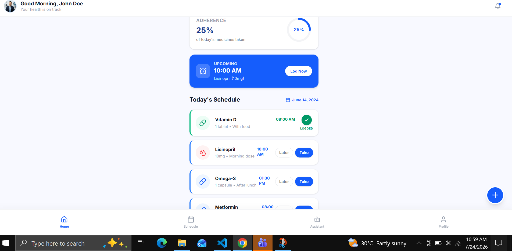
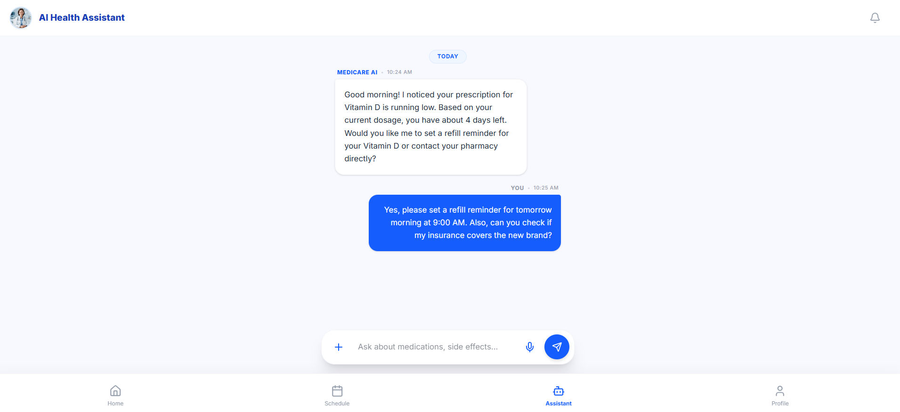

# 💊 Medicine Reminder AI

## 📌 Overview

**Medicine Reminder AI** is an intelligent web application that helps users manage their medications, receive timely reminders, and get AI-powered health assistance. The application is designed for patients, elderly users, caregivers, and anyone who needs help organizing their medication schedule.

The app solves the common problem of **forgetting to take medicines on time**, reducing missed doses and improving medication adherence through an easy-to-use interface and AI-powered guidance.

---

# 🌐 Live Demo

**Live Application:**

https://medicine-reminder-os3kjgp7k-yasha-stack1.vercel.app/

---

# 📂 GitHub Repository

https://github.com/yasha-stack/medicine-reminder-ai

---

# ✨ Features

* 🔐 User Authentication (Login & Sign Up)
* 💊 Add New Medicines
* 📋 View Medicine List
* ⏰ Medicine Reminder Management
* 🤖 AI Health Assistant powered by Google Gemini
* 👤 User Profile Management
* 📱 Responsive Design
* 🎨 Modern UI built with React and Vite
* ⚡ Fast performance and clean user experience

---

# 🤖 AI Feature

The application includes an **AI Health Assistant** that uses **Google Gemini AI** to provide general health-related guidance.

### AI Capabilities

* Answers medicine-related questions
* Provides general health information
* Explains medication usage
* Offers healthy lifestyle suggestions
* Responds naturally in conversational language

### System Prompt

The AI assistant is instructed to:

> "You are an AI Health Assistant for the Medicine Reminder AI application. Help users with general health and medicine-related questions, explain medications in simple language, encourage healthy habits, and remind users to consult qualified healthcare professionals for diagnosis or medical emergencies. Never prescribe medication or replace professional medical advice."

---

# 🛠 Technologies Used

### Frontend

* React
* TypeScript
* Vite
* CSS

### AI

* Google Gemini API

### Development

* Google AI Studio
* Google Stitch
* Visual Studio Code
* Git
* GitHub

### Deployment

* Vercel

---

# 📷 Screenshots

Add screenshots of your application here.

## Screenshot 1 – Login Screen



## Screenshot 2 – Dashboard



---

## Screenshot 3 – AI Health Assistant



---

# 🚀 Installation

Clone the repository:

```bash
git clone https://github.com/yasha-stack/medicine-reminder-ai.git
```

Open the project:

```bash
cd medicine-reminder-ai
```

Install dependencies:

```bash
npm install
```

Create a `.env` file and add:

```env
GEMINI_API_KEY=YOUR_GEMINI_API_KEY
```

Run the application:

```bash
npm run dev
```

Open:

```
http://localhost:3000
```

---

# 📁 Project Structure

```
src/
 ├── components/
 ├── App.tsx
 ├── main.tsx
 ├── index.css

assets/

server.ts

package.json
```

---

# 🎯 Problem Solved

Many people forget to take medicines on time or struggle to organize their medication schedule.

Medicine Reminder AI provides a centralized platform to:

* Track medicines
* Organize medication schedules
* Receive reminders
* Access AI-powered health guidance
* Manage personal medication information easily

---

# 👨‍💻 Author

**Yasha**

GitHub:

https://github.com/yasha-stack

---

# 📄 License

This project was developed for educational purposes.
